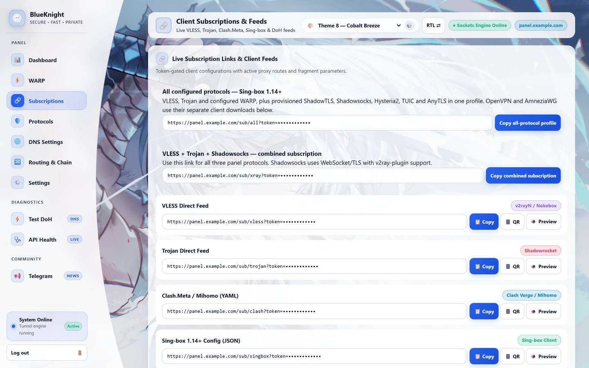

<div align="center">

# 🛡️ BlueKnight Panel

**A proxy control panel, encrypted-DNS gateway and client-subscription server — in a single file.**

Runs on Cloudflare's edge or any Node 22+ host. Carries VLESS, Trojan and Shadowsocks over WebSocket,
resolves DNS over HTTPS, and hands your clients a subscription URL that keeps itself up to date.

<br>

[](https://github.com/BlueKnightNet/Blue-Knight-Panel/releases/latest)
[](#-license)
[](https://nodejs.org)
[](https://t.me/BlueKnight_Net)

<br>

[**Download**](https://github.com/BlueKnightNet/Blue-Knight-Panel/releases/latest) ·
[**Deploy**](#-deploying-platform-by-platform) ·
[**How it works**](#-how-the-panel-works) ·
[**Security**](#-security) ·
[**Telegram**](https://t.me/BlueKnight_Net)

<br>


</div>

<br>

<table>
<tr>
<td width="50%" valign="top">

### ⚡ Eleven targets, one codebase

Cloudflare Workers and Pages, Vercel, Netlify, Fly.io, Railway, Render,
Koyeb, Docker, local, and a native sing-box stack. One `fetch` handler
serves them all — only storage and sockets differ.

</td>
<td width="50%" valign="top">

### 🔌 Protocols that work

VLESS, Trojan and Shadowsocks over WebSocket or HTTP-streaming, with TLS
ClientHello fragmentation and upstream chain proxying for stubborn networks.

</td>
</tr>
<tr>
<td width="50%" valign="top">

### 📡 DNS over HTTPS

RFC 8484 wire format and the JSON API, forwarded over HTTP/2 to any upstream
resolver, with live latency readout in the panel.

</td>
<td width="50%" valign="top">

### 🎨 Ten themes

Each with its own wallpaper and palette, embedded in the standalone build so a
one-file deploy looks the same as a full one.

</td>
</tr>
</table>

<br>

---

## 🚀 Fastest path: the release build

The [**Releases page**](https://github.com/BlueKnightNet/Blue-Knight-Panel/releases/latest)
carries prebuilt artifacts, so you do not have to clone anything.

| Artifact | What it is | Use it when |
| :--- | :--- | :--- |
| 📄 **`worker-standalone.js`** | One self-contained file — every `lib/` module inlined, all ten wallpapers embedded (1.78 MB, under the 3 MB Workers free-plan limit) | You want to paste a worker into the Cloudflare dashboard and be done |
| 📦 **`BlueKnight-Panel-5.2.1.zip`** | The full deployable project | You want the interactive picker across all eleven targets |
| 🖱️ **`BlueKnight-Deploy.cmd`** | Double-clickable Windows launcher | You already have the project and want a menu, not a CLI |

<br>

### Paste-deploy to Cloudflare Workers

```
1  Dashboard → Workers & Pages → Create → Start from Hello World
2  Edit code → select all → paste worker-standalone.js → Deploy
3  Settings → Variables → KV Namespace Bindings → bind a namespace to  BK_KV
4  Settings → Runtime → compatibility date 2024-09-23 or later + nodejs_compat
```

Then open `https://<your-worker>.workers.dev/panel` and set an admin password.

> [!IMPORTANT]
> Step 3 is not optional. Without the `BK_KV` binding the panel cannot store
> your password or sign sessions, and it will refuse to log you in rather than
> fall back to a shared key.

<details>
<summary><b>Why a separate standalone build?</b></summary>

<br>

The `worker.js` in this repo imports `./lib/dns-wire.mjs`,
`./lib/subscription-native.mjs` and `./lib/ss-websocket.mjs`, and it serves
`/assets/theme-bg-N.jpg` from a static-asset binding. Pasted into the dashboard
as-is, it fails on the first import and renders every theme on a flat colour.

`build-standalone.mjs` bundles the imports with esbuild and bakes the wallpapers
in as data URIs, re-encoded at 1600px/q72 to fit the script budget:

```bash
npm run build:standalone   # -> dist/worker-standalone.js
npm run test:standalone    # verifies imports, wallpapers and the 3MB budget
```

</details>

<br>

---

## 🌍 Deploying, platform by platform

Everything below is driven by one interactive picker. On Windows, double-click
`BlueKnight-Deploy.cmd` for the same menu.

```bash
npm run deploy          # or: node deploy.mjs
node deploy.mjs --list  # show every target
node deploy.mjs --check # run all six test suites, deploy nothing
```

`deploy.mjs` runs the full test suite as a preflight and refuses to deploy if
anything fails.

<br>

| Target | Proxy tunnel | Settings storage |
| :--- | :---: | :--- |
| **Cloudflare Workers** | ✅ | KV namespace |
| **Cloudflare Pages** | ✅ | KV binding |
| **Vercel** | ✅ | Redis REST |
| **Netlify** | ❌ panel + DNS only | Redis REST |
| **Fly.io** | ✅ | volume |
| **Railway** | ✅ | volume |
| **Render** | ✅ | disk |
| **Koyeb** | ✅ | Redis REST |
| **Docker / VPS** | ✅ | bind mount |
| **Local** | ✅ | `./data` |
| **Native (sing-box)** | ✅ | Docker volumes |

> **Proxy tunnel** = can carry VLESS/Trojan traffic. Every target serves the
> panel and DNS. Netlify's function runtime cannot hold a WebSocket open, so
> point clients at a tunnel-capable host and use Netlify for the panel only.

<br>

<details>
<summary><b>☁️ Cloudflare Workers</b></summary>

<br>

```bash
node deploy.mjs cloudflare
```

Creates the KV namespace, writes the binding, sets the compatibility flags and
deploys.

To keep a Workers deployment beside a Pages one, copy
`wrangler.workers.toml.example` to `wrangler.workers.toml`, fill in your account
and KV ids, then:

```bash
npx wrangler deploy --config wrangler.workers.toml
```

That file is gitignored because it holds real ids.

</details>

<details>
<summary><b>☁️ Cloudflare Pages</b></summary>

<br>

```bash
node deploy.mjs cloudflare-pages --project=<project> --branch=<production-branch>
```

Bindings live on the Pages project, not in `wrangler.toml`. The deploy downloads
the project's existing configuration first, so your KV binding and environment
variables survive the upload. Set the `BK_KV` binding once under
**Settings → Functions → KV namespace bindings**.

Pages serves `public/` statically, so the wallpapers come from `public/assets/`
and you do not need the standalone build.

</details>

<details>
<summary><b>▲ Vercel</b></summary>

<br>

```bash
node deploy.mjs vercel
```

Needs **Fluid compute** enabled for WebSocket tunnels, and a Redis-compatible
REST store — set `KV_REST_API_URL` and `KV_REST_API_TOKEN` (Vercel Marketplace
KV) or `UPSTASH_REDIS_REST_URL` / `UPSTASH_REDIS_REST_TOKEN`. Function duration
limits apply to long-lived tunnels.

</details>

<details>
<summary><b>◆ Netlify</b></summary>

<br>

```bash
node deploy.mjs netlify
```

Panel, DNS and subscriptions only — no proxy tunnels. Use
`UPSTASH_REDIS_REST_URL` and `UPSTASH_REDIS_REST_TOKEN` for storage.

</details>

<details>
<summary><b>🚁 Fly.io · Railway · Render · Koyeb</b></summary>

<br>

```bash
node deploy.mjs fly       # fly.toml,     persistent volume
node deploy.mjs railway   # railway.json, persistent volume
node deploy.mjs render    # render.yaml,  persistent disk
node deploy.mjs koyeb     # koyeb.yaml,   Redis REST
```

These run `server.js` on Node 22+. Settings persist to `DATA_DIR`
(default `./data`) — **mount a volume there** or the panel regenerates its
identities on every cold start. Koyeb has no disk, so give it a Redis REST store.

</details>

<details>
<summary><b>🐳 Docker / self-hosted VPS</b></summary>

<br>

```bash
docker build -t blueknight-panel .

docker run -d --name blueknight \
  -p 8080:8080 \
  -v /srv/blueknight/data:/app/data \
  -e PANEL_PASSWORD='<a strong password>' \
  -e JWT_SECRET="$(openssl rand -hex 32)" \
  blueknight-panel
```

The bind mount is what makes settings durable. Put it behind a TLS-terminating
reverse proxy — the session cookie only gets its `Secure` flag over HTTPS.

</details>

<details>
<summary><b>💻 Local</b></summary>

<br>

```bash
npm install
npm start                 # http://localhost:8080/panel
```

Settings go to `./data/blueknight_kv.json`, which is gitignored.

</details>

<details>
<summary><b>🔧 Native VPN stack</b></summary>

<br>

```bash
node deploy.mjs native --host=vpn.example.com --prepare-only

node deploy.mjs native --host=vpn.example.com \
  --protocols=shadowtls,shadowsocks,hysteria2,tuic,anytls,openvpn \
  --cert=cert.pem --key=key.pem
```

Generates a sing-box + OpenVPN Docker stack under `native/generated/`
(gitignored) with matching client profiles. TLS protocols need a real
certificate and key.

</details>

<br>

---

## ⚙️ How the panel works

### One worker, several jobs

`worker.js` exports a single `fetch` handler that every target shares — the
Cloudflare entry point, the Pages function in `functions/[[path]].js`, and the
Node server in `server.js`, which shims the Workers APIs (`WebSocketPair`,
Workers-style `Response`) onto Node's `http` and `net`. That is why one codebase
deploys to eleven places: only the storage adapter and the socket layer change.

```
                      ┌──────────────────────────────┐
   client ─── HTTPS ──▶│        worker.js fetch       │
                      └──────────────┬───────────────┘
                                     │  dispatch by path
        ┌──────────────┬─────────────┼─────────────┬──────────────┐
        ▼              ▼             ▼             ▼              ▼
    /panel/*      /bk-ws        /dns-query      /sub/*        /assets/*
   admin UI    VLESS·Trojan      DoH gateway   client feeds   wallpapers
   (session)    Shadowsocks     (RFC 8484)    (token auth)
                    │                │              │
                    ▼                ▼              ▼
              TCP to origin    upstream DoH   generated on demand
                                                    │
                                     ┌──────────────┴──────────────┐
                                     │  KV · Redis REST · JSON file │
                                     └──────────────────────────────┘
```

### Routing table

| Path | Purpose |
| :--- | :--- |
| `/panel`, `/panel/login`, `/panel/setup` | Admin UI (session-cookie auth) |
| `/bk-ws`, `/bk-ws/vless`, `/bk-ws/trojan` | WebSocket proxy inbound |
| `/bk-xhttp` | HTTP-streaming (XHTTP) inbound |
| `/dns-query`, `/dns-json` | DoH gateway — wire format and JSON |
| `/sub/<format>?token=…` | Client subscription feeds |
| `/api/node/export`, `/api/node/import` | Node-share sync between panels |
| `/api/health`, `/api/proxy-debug` | Diagnostics |
| `/assets/*` | Theme wallpapers |

`/wd-*` paths are the pre-rename aliases and still work.

### Proxy path

A client opens a WebSocket to `/bk-ws`. The worker reads the first frame, parses
it as a VLESS or Trojan header (or Shadowsocks, via `lib/ss-websocket.mjs`),
authenticates it against the UUID or password in storage, opens a TCP socket to
the requested destination with `connect()`, and pipes the two together.

Optional extras: **TLS ClientHello fragmentation** to break up SNI-based
blocking, and **chain proxying** through an upstream SOCKS/HTTP/VLESS hop.

### DNS path

`/dns-query` accepts RFC 8484 GET and POST and forwards to the configured
upstream resolver (Cloudflare by default) over HTTP/2. `/dns-json` answers the
JSON API. `lib/dns-wire.mjs` decodes wire-format answers so the panel can show
real resolution latency.

### Subscriptions



<br>

Client configs are generated on demand from current settings — nothing is stored
pre-rendered. Formats: `vless`, `trojan`, `clash`, `singbox`, `xray`,
`xray-json`, `ss`, `warp`, `amnezia`, `openvpn`, `native`, and `all` (a combined
sing-box profile). Each is a URL of the form:

```
https://<host>/sub/clash?token=<subToken>
```

Paste it into your client as a subscription and it updates itself whenever you
change settings in the panel.

### Storage

Everything mutable — the admin password hash, the session signing key, the VLESS
UUID, the Trojan password, subscription tokens and all settings — lives behind
one small key/value interface (`lib/kv-store.mjs`) with three backends:
Cloudflare KV, a Redis-compatible REST API, or a JSON file on disk. Settings are
cached in memory for a short TTL to keep KV reads down.

### WARP

The panel can register a Cloudflare WARP account, generate WireGuard keys with a
bundled X25519 implementation, and emit WARP or Amnezia (noise-obfuscated)
profiles.

<br>

---

## 🎨 Themes and backgrounds

<div align="center">

</div>

<br>

Ten themes, each with its own wallpaper, overlay tint and accent palette; the
picker and the dice button live in the panel header. `assets/README.md`
documents the theme-to-wallpaper mapping. The layout is responsive down to
320px, with an off-canvas drawer on mobile.

The images are served three different ways depending on where you deployed:

| Deployment | Wallpapers come from |
| :--- | :--- |
| Pages, Netlify, Vercel | `public/assets/`, statically |
| Node hosts (Fly, Railway, Render, Koyeb, Docker, local) | disk, streamed by `server.js` |
| Single-file Workers | data URIs baked into `worker-standalone.js` |

> If a theme ever renders on a flat colour, the wallpaper request 404'd — you are
> running an unbundled `worker.js` without an `ASSETS` binding. Use the
> standalone build.

<br>

---

## 🔒 Security

The panel is an administrative control plane for proxy tunnels. Treat it as one.

- **Set a KV binding.** `BK_KV` stores the admin password (PBKDF2-SHA256,
  210,000 iterations, per-record salt) and the session signing key. Without KV,
  set `JWT_SECRET`. If neither is present the panel refuses to sign sessions
  rather than fall back to a shared key.
- **Set a strong admin password at setup.** There is no lockout or rate limit on
  `/panel/login`: the worker is stateless, and a KV-backed attempt counter costs
  a write per request, which is both a quota cost and its own denial-of-service
  lever. Put a Cloudflare WAF rate-limiting rule on `/panel/login` if the panel
  is reachable from the internet.
- **Keep subscription tokens out of shared links.** `/sub/*` and
  `/api/node/export` authenticate on a query-string token. Responses are sent
  with `Referrer-Policy: no-referrer`, but anyone holding the URL holds the
  credential. Rotate from Settings if one leaks.
- **Never commit `data/`, `.dev.vars`, or a filled-in `wrangler.workers.toml`.**
  They hold the password hash, signing key, VLESS UUID and Trojan password.
  `.gitignore` covers them; check `git status` before a first push anyway.

Every response carries `X-Frame-Options: DENY`, `X-Content-Type-Options:
nosniff` and `Referrer-Policy: no-referrer`. HTML responses add a Content
Security Policy with `form-action 'self'`, `base-uri 'none'` and
`frame-ancestors 'none'`.

> Upgrading from an older release migrates itself: log in once with your existing
> password and the stored cleartext is replaced by a PBKDF2 record.

<br>

---

## 🧪 Development

```bash
npm install
npm start                # run locally on :8080
npm run test:all         # six regression suites
npm run build:standalone # dist/worker-standalone.js
npm run test:standalone  # check the release artifact
```

| Suite | Covers |
| :--- | :--- |
| `test.mjs` | Settings persistence, tab deep links |
| `test-edge.mjs` | Vercel/Netlify KV adapters, env identity |
| `test-proxy.mjs` | Frame codec, WebSocket handshake, VLESS→TCP echo |
| `test-connections.mjs` | CONNECT/SOCKS5, HTTP streaming, all subscription routes |
| `test-adapters.mjs` | Serverless adapter round-trips |
| `test-dns.mjs` | DNS wire decoding and HTTP/2 forwarding |

`deploy.mjs` runs all six before any deployment.

<br>

---

## 🔗 Links

- 📢 **[@BlueKnight_Net on Telegram](https://t.me/BlueKnight_Net)** — releases, support, development news
- 📘 **[Deployment guide](DEPLOYMENT.md)** — per-provider detail, update procedures, verification
- 🔍 **[Connection audit](CONNECTION-AUDIT.md)** — protocol and transport coverage notes

<br>

## 📄 License

MIT

<br>

<div align="center">
<sub>Built for people who need the open internet. · <a href="https://t.me/BlueKnight_Net">@BlueKnight_Net</a></sub>
</div>
